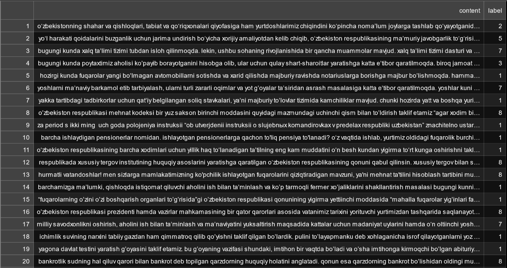
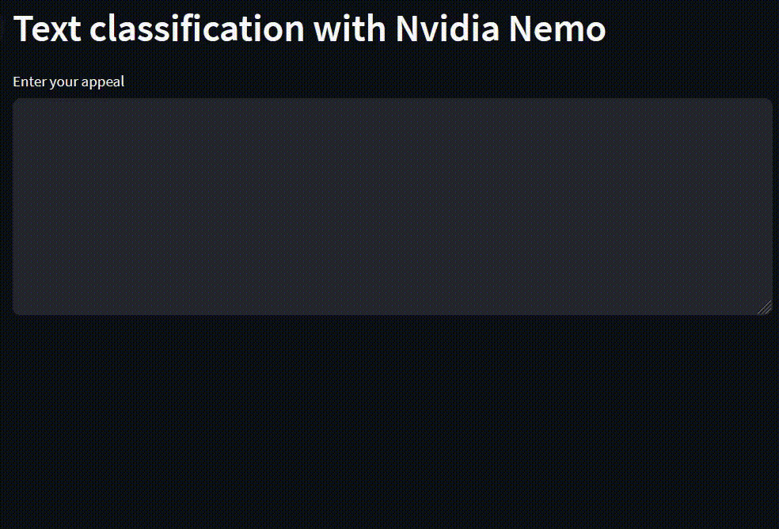

[](https://colab.research.google.com/drive/1Jb3MY7FOkWfWyoZmzcI9uMJ4AHCf2fxu#scrollTo=92PB0iTqNnW-)

# Easy appeal

## Introduction

Usually, appeals sent to state bodies are collected in one place and sorted according to which state body it belongs to. Sorted applications are sent to the relevant state bodies. For example, some applications may belong to the Ministry of Transport, and some to the Ministry of Health. The person who sent the request cannot know whether the request is being studied or is still pending. This can take hours, days, or even months. We used artificial intelligence to solve this problem.

This project will help us to easily analyze the appeals sent by the people to the government bodies and solve the problem. That is, the applicant sends his application to this program. and the program delivers this appeal to the relevant state bodies. The solution to the problem will alert the sender. In our case, it classifies applications for 8 state bodies. They are:

1. Communications (Aloqa va kommunikatsiya)
2. Money relations (Pul munosabatlari)
3. Ecology (Ekologiya)
4. Sanitation (Sanitariya)
5. Religion and Nation (Din va Millat)
6. Transport (Transport)
7. Family (Oila)
8. Education and culture (Ta'lim va madaniyat)
9. None (Hech qaysiga kirmaydi)

## Dataset format

TextClassificationModel in NeMo supports text classification problems such as sentiment analysis or domain/intent detection for dialogue systems, as long as the data follows the format specified below.

TextClassificationModel requires the data to be stored in TAB separated files (.tsv) with two columns of sentence and label. Each line of the data file contains text sequences, where words are separated with spaces and label separated with [TAB], i.e.:

[WORD][SPACE][WORD][SPACE][WORD][TAB][LABEL]

For example:

hide new secretions from the parental units[TAB]0

that loves its characters and communicates something rather beautiful about human nature[TAB]1
...

<a></a>

If your dataset is stored in another format, you need to convert it to this format to use the TextClassificationModel.

# Installation

1. install necessary libraries

```
pip install -r requirements.txt
```

2. install nemo

```
python -m pip install git+https://github.com/NVIDIA/NeMo.git@main#egg=nemo_toolkit[nlp]
```

# Train

```
python train.py --data path/to/dataset --work path/to/configs
```

# Deployments

## Python console code

```
python inference.py --input path/to/input/text/file --output path/to/output/text/file
```

## Telegram bot

```
python bot.py
```

The result is as follows:


## Streamlit

```
streamlit run stream.py
```

The result is as follows:



# Requirements

1. Linux
2. Python 3.8
3. Pytorch 1.10.0 or above
4. NVIDIA GPU for training
